# 龙芯2F安装NetBSD

由于疫情严重，在家里闲来无事，家里小娃娃总看小猪佩奇，所以总爬到凳子上坐在那里修我的电脑。

我的电脑当然比较金贵了，里面都是各种资料和代码，所以我就把多年以前200块买的珍贵的龙芯2F Lemote 给她玩，也算是让国产芯片发热一回。

可是我们家2岁的小姑娘看着里面安装的 RedFlag 系统没法启动，只能在登录界面随便敲击，几下就没意思了。

可是陈旧的 RedFlag 系统，估计是没法找到了。重装系统，目前根据业内的支持，估计也就只有我大学时研究过的 NetBSD了。

于是到 NetBSD 网站找找，果然是可以的。下面就是我的系统安装步骤了。

## Lemote 龙芯小本本

简单的介绍：

- CPU: Loongson 2F (800MHz)
- 指令集: MIPS64 EL
- 内存： 1GB
- 硬盘: 150GB
- 引导： pmon ，支持 ext2 文件系统加载内核【注意】
- 用户手册：http://www.loongson.cn/uploadfile/cpumanual/Loongson2F_UM_CN_V1.5.pdf
- 数据手册：http://www.loongson.cn/uploadfile/cpumanual/Loongson2F_DS_CN_V1.1.pdf

## NetBSD 龙芯支持

- [wiki 关于 Loongson](https://wiki.netbsd.org/ports/evbmips/loongson/)
- [NetBSD 8.1 龙芯内核下载](https://cdn.netbsd.org/pub/NetBSD/NetBSD-8.1/evbmips-mips64el/binary/kernel/)
  * **netbsd-LOONGSON.gz** 为龙芯 2F 内核
- [NetBSD 8.1 龙芯安装引导下载](https://cdn.netbsd.org/pub/NetBSD/NetBSD-8.1/evbmips-mips64el/installation/)
  * **netbsd-INSTALL_LOONGSON.gz** 为龙芯 2F 安装执行文件压缩包

- [NetBSD 8.1 MIPS64EL 镜像下载]
  * **NetBSD-8.1-evbmips-mips64el.iso** 为 NetBSD 8.1 龙芯安装用的系统包

## NetBSD 安装准备

- 一台可以工作的 Linux 电脑【最好是linux电脑，用于制作安装盘】
- 2个 4GB 【以上】 U 盘
  * 1 个格式化为 ext2 文件系统，放置 *netbsd-INSTALL_LOONGSON* 安装执行系统和真正的 NetBSD 内核 *netbsd-LOONGSON*。
     
     1. 格式化 U盘 文件系统：
        ```
        sudo mkfs.ext2 /dev/sda
        sudo mount -t ext2 /dev/sda /mnt
        ```
        具体的 */dev/sda* 参考，你的系统中U盘设备名称。

     2. 解压缩 NetBSD 内核以及安装程序压缩包：
        ```
        gzip -d netbsd-INSTALL_LOONGSON.gz
        gzip -d netbsd-LOONGSON.gz
        ```

     3. 拷贝内核和安装程序到系统盘：
        ```
        sudo cp netbsd-LOONGSON /mnt
        sudo cp netbsd-INSTALL_LOONGSON /mnt
        ```


  * 一个用于 NetBSD 8.1 的 iso 系统包烧录，具体执行指令如下：
    ```
    sudo dd if=NetBSD-8.1-evbmips-mips64el.iso of=/dev/sdb
    ```

    NetBSD 系统压缩的 iso 镜像格式为 `cd9660` 格式，可以直接 `dd` 到 U 盘，并且可以被系统识别，类似于 ubuntu 等 Linux 系统的 Live CD 格式。
- 一台 Longson 2F 笔记本。没有这个是肯定不行了。   

## NetBSD 系统安装

1. 将 `ext2` 格式的安装 U 盘插入 Lemote 。
2. 上电启动 Loongson 2F 。
3. 开机后，看到 “中科龙梦” 引导界面时，按下 `Del` 进入 pmon 指令交互模式。具体显示如下：
   ```
   BEV in SR set to zero.
   PMON>
   ```
4. 通过 `dir` 指令确认 usb 是否正常。
    ```
    PMON> dir (usb0,0)
    .                           <DIR>
    ..                          <DIR>
    netbsd-INSTALL_LOONGSON     <FILE>      13498552
    ```

    如果其中可以显示上述目录和文件，确认 U盘 制作正确。

5. 加载安装程序执行文件。

    ```
    PMON> boot -k /dev/fs/ext2@usb0/netbsd-INSTALL_LOONGSON 
    ```

    **由于通过龙芯本本安装截图不方便，这里选择用 virtualbox + netbsd 进行模拟安装演示。但是具体的操作过程，在龙芯小本里是一样的。**
6. 加载完成后，将会载入 NetBSD 内核以及进入 `sysinst` 安装程序。
7. 启动安装界面选择 “Installation messages in English”。

8. 键盘选择 "Unchanged"。
9. 安装方式选择 "Install NetBSD to hard disk"
10. 进行分区设置，选择 `Yes`：
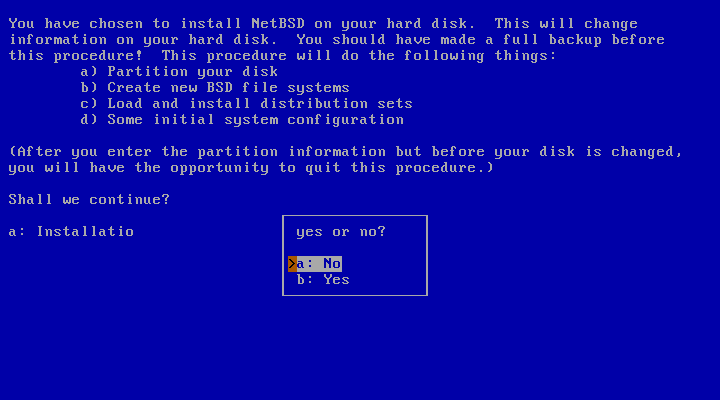

11. 选择分区硬盘，此处选择 `wd0` ：
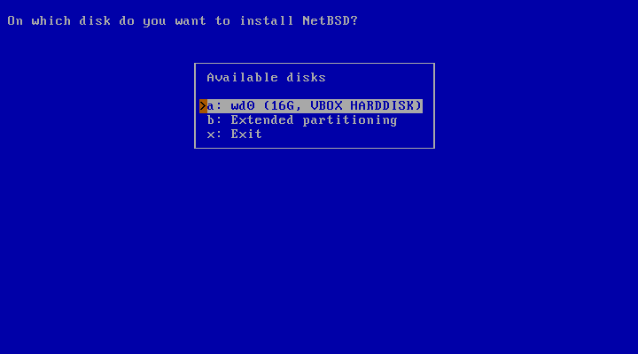

12. 确认安装磁盘正确，选择 `This is the correct geometry` ：
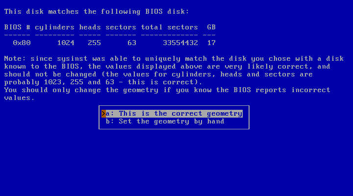

13. MBR分区设置，**因为需要增加自定义 ext2 分区**，这里我们选择进行自定义 MBR 分区，选择 `Edit the MBR partition table` ：
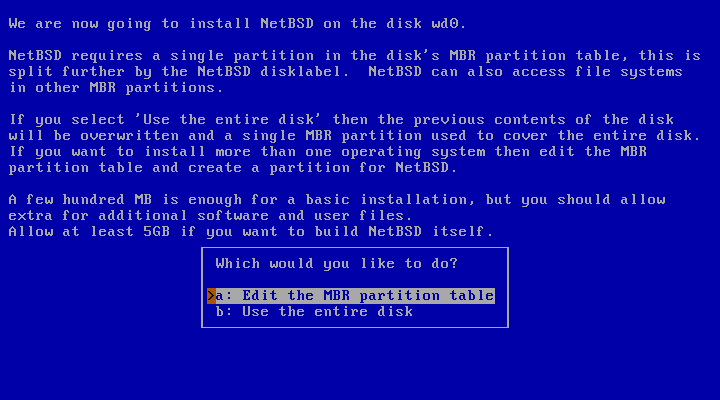


13. MBR分区设置，**因为需要增加自定义 ext2 分区**，这里我们选择进行自定义 MBR 分区，选择 `Edit the MBR partition table` ：


14. 分区设置过程，增加一个 `64MB` 的`Linux native` 分区和 一个 `NetBSD 分区` 占用其他剩余空间。

    1. 增加 `Linux native` 分区，指定大小为 64M 时，会自动调整为 70M，此处需要注意。
       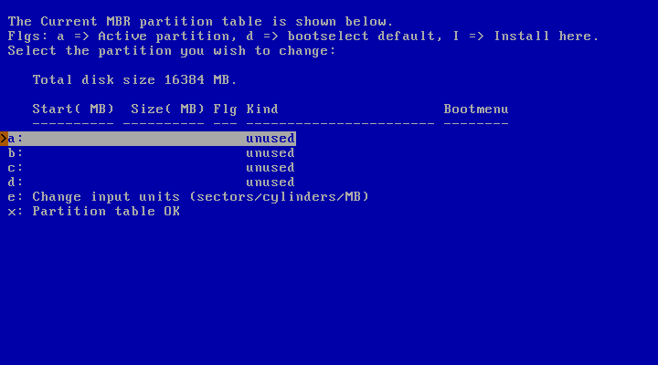
       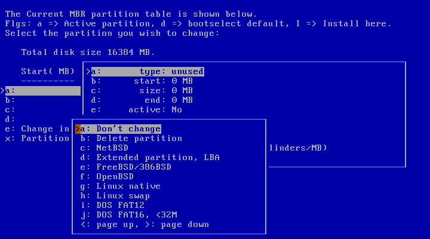
       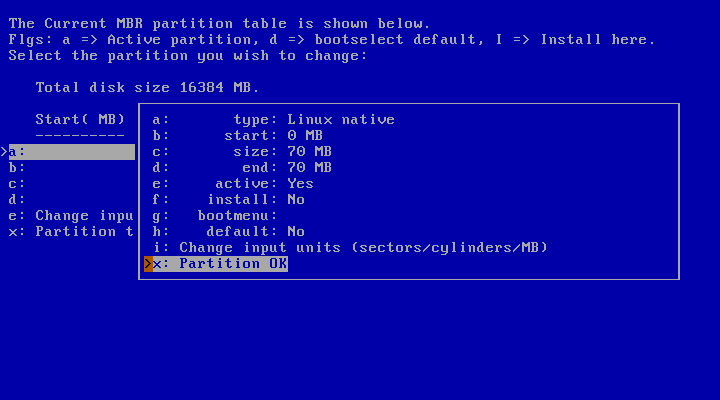
    2. 增加 `NetBSD` 分区，并且设置为安装分区。
       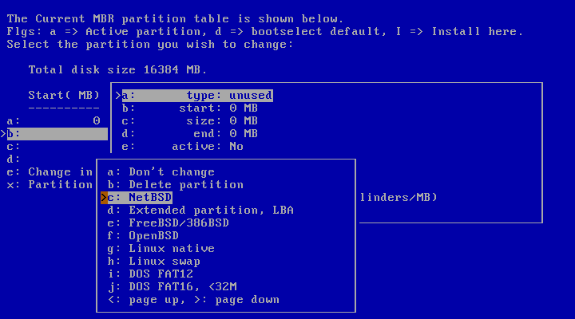
       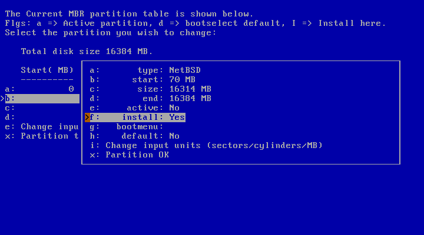

       **对于 NetBSD 分区，需要确认 `install` 标志为 `Yes` 。**
    3. 最终主分区确认。

       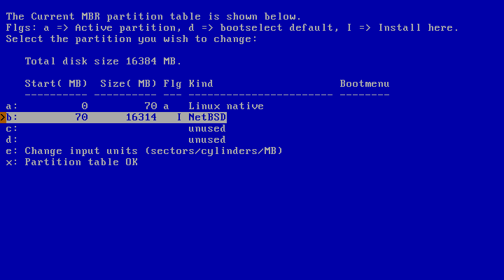

15. NetBSD 系统安装分区设置。

    1. 选择设置 NetBSD 安装分区大小分配，选择 `Set sizes of NetBSD partitions`。
        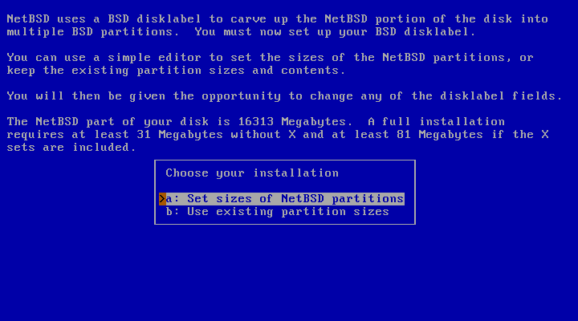 

    2. 确认 NetBSD 各个系统分区大小，基本无需改动。
       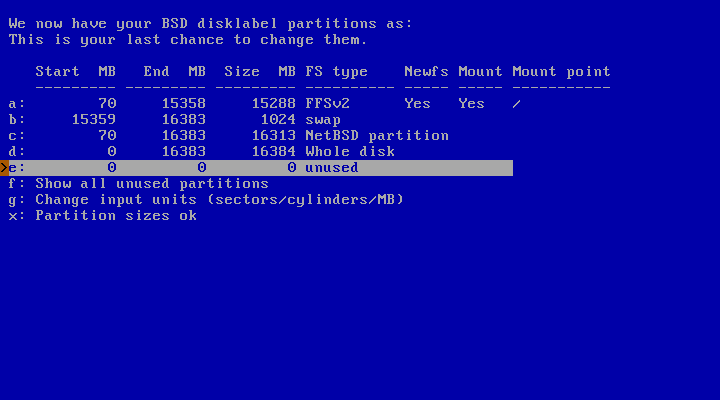 

    3. 将之前预分配的 `Linux native` 分区设置为 `ext2fs` 文件系统，并配置挂载到 `/boot` 目录。
       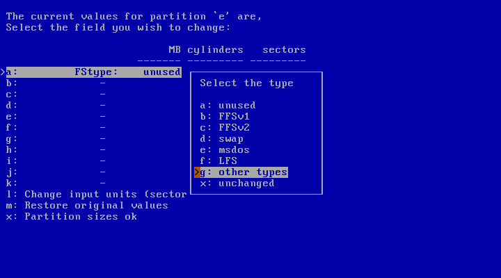 

       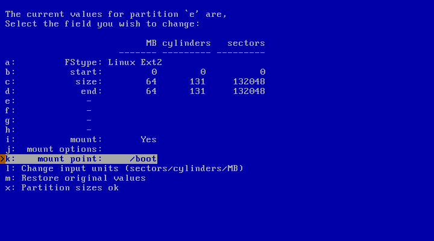
    4. 最终的分区如下：
        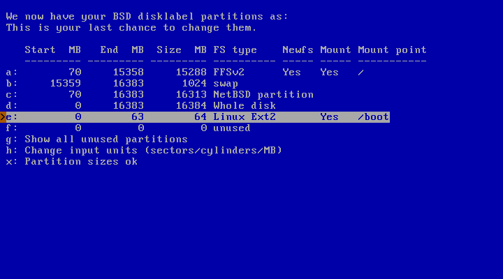 

16. NetBSD 软件安装，为了便利，我们选择自定义安装，选择 `Custom installation`。
    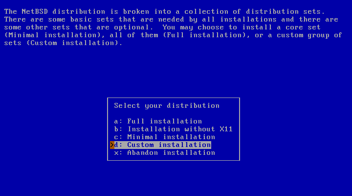

    对于 x11 相关设置，默认不会安装，尽量勾选所有组件，剩的后续缺少东西，也可以勾选编译器，游戏，等等软件包。
    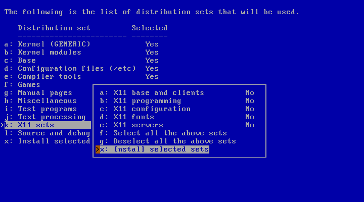
     

17. 软件包确认后，将会自动进行软件安装，安装完成后将会弹出如下配置界面：

    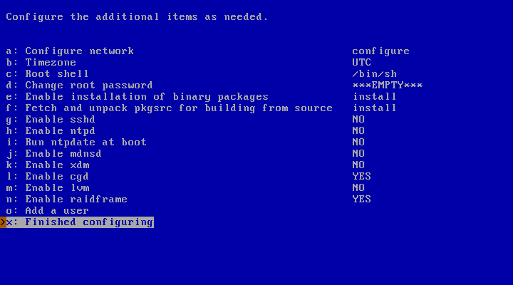

    * 如果勾选了 `x11` 部分，以及启动 `xdm`，请必须设置 root 密码，否则登录不进去。
    * 也可以根据自己需要添加用户名。

18. 在完成上述配置后，将会回到如下界面：

    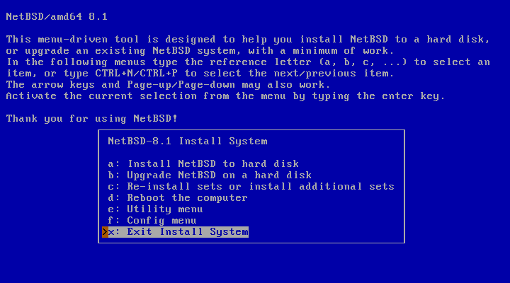

19. 选择 `Exit Install System` 进入安装系统 shell 命令行。
20. 这是我们最后的步骤，进行最后的 `pmon` 支持的 ext2 分区处理。

    0. `chroot` 到我们最新安装的系统，为了使用 `vi` 等指令，因为在安装系统中只存在有限的指令。后续的指令都必须在 `chroot` 后的环境执行。
       ```
       mount /dev/wd0a /mnt
       chroot /mnt
       ```

    1. 格式化 `/dev/wd0e` 分区为 `ext2fs` 格式
        ```
        newfs_ext2fs /dev/rwd0e
        ```

        **特别注意，此处 `/dev/wd0e` 与 `/dev/rwd0e` 相对应，我们创建分区只能通过 `/dev/rXXX` 进行操作，包括后续的 `fsck_ext2fs` 也一样。**
    2. 挂载 `/dev/wd0e` 到 `/mnt` 位置。

       ```
       mkdir -p /boot
       mount -t ext2fs /dev/wd0e /boot
       ```
    
    3. 挂载 U 盘，以及拷贝 U 盘中的 netBSD 内核到硬盘上的 `/boot` 位置。

       ```
       mount -t ext2fs /dev/sd2 /mnt
       cp /mnt/netbsd-LOONGSON /boot
       cp /mnt/netbsd-INSTALL_LOONGSON /boot
       umount /mnt
       ```

       **此处拷贝安装可执行程序 `netbsd-INSTALL_LOONGSON`，是为了方便进行后续的再次升级，或者重新安装**
    4. 增加 `boot.cfg` 用于系统自动启动，在 `/boot` 中创建文件 `boot.cfg`, 其中内容如下。
       ```
       Timeout 5
       Default 0
       Showmenu 1
       Title NetBSD for Loongson
       Kernel=/dev/fs/ext2@wd0/netbsd-LOONGSON
       ```

       **如此，我们就可以实现开机自启动 NetBSD 系统了。**